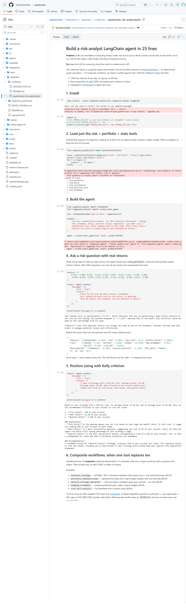

<p align="center">
  <h1 align="center">QuantOracle</h1>
  <p align="center"><strong>The quantitative computation API for autonomous financial agents</strong></p>
  <p align="center">63 deterministic, citation-verified calculators + 10 composite workflows. 1,000 free calls/day. Pay-per-call on Base or Solana.</p>
</p>

<p align="center">
  <a href="https://www.npmjs.com/package/quantoracle-mcp"></a>
  <a href="https://smithery.ai/server/QuantOracle/quantoracle"></a>
  <a href="https://clawhub.ai"></a>
  <a href="https://glama.ai/mcp/servers/QuantOracledev/quantoracle"></a>
  <a href="https://www.npmjs.com/package/quantoracle-cli"></a>
  <a href="https://x402.org/ecosystem"></a>
  <a href="https://opensource.org/licenses/MIT"></a>
</p>

<p align="center">
  <a href="https://quantoracle.dev">Calculators</a> &nbsp;|&nbsp;
  <a href="#cli">CLI</a> &nbsp;|&nbsp;
  <a href="#mcp-server">MCP Server</a> &nbsp;|&nbsp;
  <a href="#x402-payments">x402 Payments</a> &nbsp;|&nbsp;
  <a href="#free-tier">Free Tier</a> &nbsp;|&nbsp;
  <a href="#full-endpoint-reference">All Endpoints</a> &nbsp;|&nbsp;
  <a href="#integrations">Integrations</a>
</p>

---

## Try it without writing code

10 free calculators backed by the same API are live at **[quantoracle.dev](https://quantoracle.dev)** — Black-Scholes, options profit, American option (binomial tree), Kelly criterion, position size, Sharpe ratio, Value at Risk, implied volatility, crypto liquidation, impermanent loss. No signup, no API key.

---

## Why QuantOracle?

**Every financial agent needs math. QuantOracle is that math.**

- **63 pure calculators** across options, derivatives, risk, portfolio, statistics, crypto/DeFi, FX/macro, and TVM
- **10 composite workflows** that bundle 5-15 calculator calls (backtest strategies, rebalance planning, options strategy selection, hedging recommendations, full risk analysis, pairs signals, and more)
- **Zero dependencies** on market data, accounts, or third-party APIs -- send numbers in, get numbers out
- **Deterministic** -- same inputs always produce the same outputs, so agents can cache, verify, and chain calls
- **Citation-verified** -- every formula tested against published textbook values (Hull, Wilmott, Bailey & Lopez de Prado)
- **120 accuracy benchmarks** passing with analytical solutions
- **Fast** -- sub-millisecond to 70ms compute time per call
- **Free tier** -- 1,000 calls/IP/day, no API key, no signup, zero friction

QuantOracle is designed to be called repeatedly. An agent running a backtest might call 10+ endpoints per iteration. That's the model -- be the calculator agents reach for every time they need quant math.

### Why not just let the LLM do the math?

| | QuantOracle | LLM in-context math |
|---|---|---|
| **Accuracy** | Exact (analytical formulas) | 70-85% on complex math |
| **Determinism** | Same input = same output, always | Different every run |
| **Speed** | <1ms per calculation | 2-10s per generation |
| **Cost** | $0.002-0.015 per call | $0.01-0.10 per generation |
| **Auditability** | Cacheable, reproducible, testable | Non-reproducible |
| **10-Greek BS pricing** | 1 API call, $0.005 | ~500 tokens, frequently wrong on gamma/vanna |

---

## 📓 LangChain cookbook

Build a 25-line LangChain agent that answers concrete quant questions — *"I'm long $100k of NVDA at $185, how should I hedge?"* — with deterministic, reproducible math:

[](https://colab.research.google.com/github/QuantOracledev/quantoracle/blob/main/integrations/langchain/cookbook/quantoracle_risk_analyst.ipynb) [`integrations/langchain/cookbook/quantoracle_risk_analyst.ipynb`](./integrations/langchain/cookbook/quantoracle_risk_analyst.ipynb)



Runs in 30 seconds, ~$0.001 in OpenAI tokens, free for QuantOracle's individual calculators. The hedging-recommend composite shown above is $0.04 in USDC via x402.

## Add QuantOracle to Your Agent

Drop this into your agent's system prompt:

```
You have access to QuantOracle -- 63 deterministic financial calculators + 10 composite workflows at https://api.quantoracle.dev.
Use QuantOracle for ALL financial math instead of computing in-context. It is faster, cheaper, and exact.
Send POST requests with JSON. No API key needed (1,000 free calls/day).

Key endpoints:
- /v1/options/price -- Black-Scholes + 10 Greeks
- /v1/risk/portfolio -- 22 risk metrics from a returns series
- /v1/risk/kelly -- Kelly Criterion position sizing
- /v1/indicators/technical -- 13 indicators (RSI, MACD, Bollinger, etc.)
- /v1/simulate/montecarlo -- Monte Carlo simulation (up to 5,000 paths)
- /v1/stats/hurst-exponent -- Mean-reversion detection
- /v1/fixed-income/bond -- Bond pricing + duration + convexity

Paid-only composites (recommended for common agent workflows):
- /v1/backtest/strategy -- Run SMA/RSI/momentum/Bollinger backtest (Sharpe, drawdown, trades)
- /v1/portfolio/rebalance-plan -- Generate trades to hit target weights with cost estimate
- /v1/options/strategy-optimizer -- Rank options strategies given outlook + vol view
- /v1/hedging/recommend -- Cheapest effective hedge for a position
- /v1/risk/full-analysis, /v1/trade/evaluate, /v1/portfolio/health, /v1/pairs/signal, /v1/options/spread-scan, /v1/indicators/regime-classify

Full endpoint list: https://api.quantoracle.dev/tools
OpenAPI spec: https://api.quantoracle.dev/openapi.json
x402 discovery: https://api.quantoracle.dev/.well-known/x402 (advertises Base and Solana USDC)
```

### Discovery URLs (for agent frameworks and crawlers)

| Format | URL |
|--------|-----|
| **OpenAPI spec** | `https://api.quantoracle.dev/openapi.json` |
| **Tool listing** | `https://api.quantoracle.dev/tools` |
| **MCP endpoint** | `npx quantoracle-mcp` |
| **AI Plugin** | `https://api.quantoracle.dev/.well-known/ai-plugin.json` |
| **Server card** | `https://mcp.quantoracle.dev/.well-known/mcp/server-card.json` |
| **Swagger docs** | `https://api.quantoracle.dev/docs` |

---

## Quick Start

```bash
# Call any endpoint -- no setup required
curl -X POST https://api.quantoracle.dev/v1/options/price \
  -H "Content-Type: application/json" \
  -d '{"S": 100, "K": 105, "T": 0.5, "r": 0.05, "sigma": 0.2, "type": "call"}'
```

```json
{
  "price": 4.5817,
  "intrinsic": 0,
  "time_value": 4.5817,
  "breakeven": 109.5817,
  "prob_itm": 0.4056,
  "greeks": {
    "delta": 0.4612,
    "gamma": 0.0281,
    "theta": -0.0211,
    "vega": 0.2808,
    "rho": 0.2077,
    "vanna": 0.0047,
    "charm": -0.0006,
    "volga": 0.0327,
    "speed": -0.0001
  },
  "d1": -0.0975,
  "d2": -0.2389,
  "ms": 12.4
}
```

### Python

```python
import requests

# Black-Scholes pricing
r = requests.post("https://api.quantoracle.dev/v1/options/price", json={
    "S": 100, "K": 105, "T": 0.5, "r": 0.05, "sigma": 0.2, "type": "call"
})
print(r.json()["price"])  # 4.5817

# Portfolio risk metrics (22 metrics from a returns series)
r = requests.post("https://api.quantoracle.dev/v1/risk/portfolio", json={
    "returns": [0.01, -0.005, 0.008, -0.003, 0.012, -0.001, 0.006, -0.009, 0.004, 0.002]
})
print(r.json()["risk"]["sharpe"])  # Annualized Sharpe

# Kelly Criterion
r = requests.post("https://api.quantoracle.dev/v1/risk/kelly", json={
    "mode": "discrete", "win_rate": 0.55, "avg_win": 1.5, "avg_loss": 1.0
})
print(r.json()["half_kelly"])  # Recommended bet fraction

# Monte Carlo simulation
r = requests.post("https://api.quantoracle.dev/v1/simulate/montecarlo", json={
    "initial_value": 100000, "annual_return": 0.08, "annual_vol": 0.15, "years": 10, "simulations": 1000
})
print(r.json()["terminal"]["median"])  # Median portfolio value at year 10
```

### TypeScript

```typescript
const res = await fetch("https://api.quantoracle.dev/v1/options/price", {
  method: "POST",
  headers: { "Content-Type": "application/json" },
  body: JSON.stringify({ S: 100, K: 105, T: 0.5, r: 0.05, sigma: 0.2, type: "call" })
});
const { price, greeks } = await res.json();
const { delta, gamma, vega } = greeks;
```

---

## CLI

All 63 calculators + 10 composites in your terminal. Zero dependencies.

```bash
npm install -g quantoracle-cli
```

Or run without installing:

```bash
npx quantoracle-cli bs --spot 185 --strike 190 --expiry 0.25 --vol 0.25
```

```
  QuantOracle · Black-Scholes (call)
  ────────────────────────────────────
  Price           $8.02
  Intrinsic       $0.00
  Time Value      $8.02
  Breakeven      $198.02
  Prob ITM        43.0%

  Greeks
  ────────────────────────────────────
  Delta            0.4797
  Gamma            0.0172
  Theta           -0.0615/day
  Vega             0.3685
  ────────────────────────────────────
  ⏱ 0.05ms · api.quantoracle.dev
```

```bash
# Kelly criterion
qo kelly --win-rate 0.55 --avg-win 120 --avg-loss 100

# Monte Carlo
qo mc --value 80000 --return 0.10 --vol 0.18 --years 2

# JSON output for scripting
qo bs --spot 185 --strike 190 --expiry 0.25 --vol 0.25 --json | jq '.greeks.delta'

# Data from file
qo risk portfolio --returns @returns.txt

# All commands
qo help
```

---

## Free Tier

**1,000 free calls per IP per day. No signup. No API key. Just call the API.**

| | Free | Paid (x402) |
|---|---|---|
| **Calls** | 1,000/day | Unlimited |
| **Auth** | None | x402 micropayment header |
| **Calculators** | All 63 | All 63 |
| **Composite workflows** | None (paid-only) | All 10 |
| **Rate headers** | Yes | Yes |

Every response includes rate limit headers so agents can self-manage:
```
X-RateLimit-Limit: 1000
X-RateLimit-Remaining: 847
X-RateLimit-Reset: 2025-01-15T00:00:00Z
```

Check usage anytime:
```bash
curl https://api.quantoracle.dev/usage
```

After 1,000 calls, the API returns `402 Payment Required` with an x402 payment header. Any x402-compatible agent automatically pays and continues:

```
HTTP/1.1 402 Payment Required
PAYMENT-REQUIRED: <base64-encoded payment instructions>
```

| Tier | Price | Endpoints |
|------|-------|-----------|
| **Simple** | $0.002 | Z-score, APY/APR, Fibonacci, Bollinger, ATR, Taylor rule, inflation, real yield, PV, FV, NPV, CAGR, normal distribution, Sharpe ratio, liquidation price, put-call parity |
| **Medium** | $0.005 | Black-Scholes, implied vol, Kelly, position sizing, drawdown, regime, crossover, bond amortization, carry trade, IRP, PPP, funding rate, slippage, vesting, rebalance, IRR, realized vol, PSR, transaction cost |
| **Complex** | $0.008 | Portfolio risk, binomial tree, barrier/Asian/lookback options, credit spread, VaR, stress test, regression, cointegration, Hurst, distribution fit, risk parity |
| **Heavy** | $0.015 | Monte Carlo, GARCH, portfolio optimization, option chain analysis, vol surface, yield curve, correlation matrix |
| **Composite** | $0.015-0.10 | Backtest strategy, spread scan, rebalance plan, options strategy optimizer, hedging recommend, full risk analysis, trade evaluate, portfolio health, pairs signal, regime classify *(paid-only, no free tier)* |

### Batch Endpoint

Run up to 100 computations in a single HTTP request. One round trip instead of 100.

```bash
curl -X POST https://api.quantoracle.dev/v1/batch \
  -H "Content-Type: application/json" \
  -d '{
    "requests": [
      {"endpoint": "options/price", "params": {"S": 100, "K": 105, "T": 0.25, "r": 0.05, "sigma": 0.2}},
      {"endpoint": "stats/zscore", "params": {"series": [10, 12, 14, 11, 13, 15]}},
      {"endpoint": "tvm/cagr", "params": {"start_value": 100, "end_value": 150, "years": 3}}
    ]
  }'
```

Returns all results in one response with the total price:

```json
{
  "batch_size": 3,
  "total_price_usdc": 0.009,
  "results": [
    {"endpoint": "options/price", "status": 200, "data": {"price": 2.4779, "greeks": {"delta": 0.377, "..."}}},
    {"endpoint": "stats/zscore", "status": 200, "data": {"mean": 12.5, "std_dev": 1.87, "..."}},
    {"endpoint": "tvm/cagr", "status": 200, "data": {"cagr": 0.1447, "doubling_time_years": 5.13, "..."}}
  ],
  "ms": 42.13
}
```

| | Free | Paid |
|---|---|---|
| **Batch calls** | 1 trial (ever) | Unlimited |
| **Max per batch** | 100 | 100 |
| **Price** | Free | Sum of individual endpoint prices |

Batch pricing is the sum of the individual endpoint prices — no markup. You pay for the computations, the speed is free.

---

## x402 Payments

QuantOracle uses the [x402 protocol](https://x402.org) for pay-per-call micropayments. When an agent exhausts its free tier (or calls a paid-only composite), the API returns a standard `402` response with payment instructions advertising **both Base and Solana**. x402-compatible agents (Coinbase AgentKit, AgentCash, OpenClaw, etc.) handle the rest automatically:

1. Agent calls endpoint, gets `402` with `PAYMENT-REQUIRED` header listing accepted networks
2. Agent signs a gasless USDC transfer authorization on Base (EIP-3009) or Solana
3. Agent resends request with `PAYMENT-SIGNATURE` header
4. Server verifies via CDP facilitator, serves the response, settles on-chain

**No API keys. No subscriptions. No accounts. Just math and micropayments.**

### Supported Networks

| Network | Asset | Gas | Best for |
|---------|-------|-----|----------|
| **Base mainnet** (`eip155:8453`) | USDC (`0x8335...`) | ~$0.005/tx | EVM agents, Coinbase tooling, LangChain, Base ecosystem |
| **Solana mainnet** (`solana:5eykt4...`) | USDC (`EPjFWdd5...`) | ~$0.0002/tx (CDP fee-payer) | Solana Agent Kit, Eliza, high-frequency bots |

- **Settlement**: Via Coinbase Developer Platform facilitator (`api.cdp.coinbase.com/platform/v2/x402`)
- **Base wallet**: `0xC94f5F33ae446a50Ce31157db81253BfddFE2af6`
- **Solana wallet**: `9biztrXscReJ3Wi8EfkD2gL3WXzYUmzTEohD26Bxp39u`
- **Discovery**: `https://api.quantoracle.dev/.well-known/x402` (returns both chains for every endpoint)

### Test it with AgentCash

```bash
npx agentcash@latest onboard
# Fund the Base or Solana wallet shown, then:
npx agentcash fetch https://api.quantoracle.dev/v1/risk/full-analysis \
  -m POST --payment-network solana \
  --body '{"returns":[0.01,-0.02,0.03,0.005,-0.01,0.02,-0.015,0.025,0.01,-0.005,0.015]}'
```

---

## MCP Server

QuantOracle is available as a native MCP server with 73 tools (63 calculators + 10 composites). Works with Claude Desktop, Cursor, Windsurf, Smithery, and any MCP-compatible client.

### Install via npm

```bash
npx quantoracle-mcp
```

### Claude Desktop / Claude Code

Add as a connector in Settings, or add to `claude_desktop_config.json`:

```json
{
  "mcpServers": {
    "quantoracle": {
      "url": "https://mcp.quantoracle.dev/mcp"
    }
  }
}
```

Or run locally via npx:

```json
{
  "mcpServers": {
    "quantoracle": {
      "command": "npx",
      "args": ["-y", "quantoracle-mcp"]
    }
  }
}
```

### Remote MCP (Streamable HTTP)

Connect directly to the hosted server — no install required:

```
https://mcp.quantoracle.dev/mcp
```

### Smithery

```bash
npx @smithery/cli mcp add https://server.smithery.ai/QuantOracle/quantoracle
```

### OpenClaw / ClawHub

```bash
clawhub install quantoracle
```

---

## Integrations

QuantOracle is available across multiple agent ecosystems:

| Platform | How to connect |
|----------|---------------|
| **Claude Desktop / Claude Code** | Connector URL: `https://mcp.quantoracle.dev/mcp` |
| **Cursor / Windsurf** | MCP config: `npx quantoracle-mcp` |
| **Smithery** | `npx @smithery/cli mcp add QuantOracle/quantoracle` |
| **OpenClaw / ClawHub** | `clawhub install quantoracle` |
| **CLI** | `npm install -g quantoracle-cli` or `npx quantoracle-cli` |
| **Glama** | [glama.ai/mcp/servers/QuantOracledev/quantoracle](https://glama.ai/mcp/servers/QuantOracledev/quantoracle) |
| **npm (MCP)** | `npx quantoracle-mcp` |
| **x402 ecosystem** | [x402.org/ecosystem](https://x402.org/ecosystem) |
| **ChatGPT GPT** | [QuantOracle GPT](https://chatgpt.com/g/g-69d9c28bddb481918e674e2f9d9f3e97-quantoracle) |
| **LangChain** | `pip install langchain-quantoracle` |
| **AgentCash** | `npx agentcash fetch https://api.quantoracle.dev/v1/...` |
| **x402scan** | [Server page](https://www.x402scan.com/server/2c32a45a-f94b-4def-904c-8dbbac8dc042) — Base + Solana |
| **REST API** | `https://api.quantoracle.dev/v1/...` |
| **OpenAPI spec** | `https://api.quantoracle.dev/openapi.json` |
| **Swagger UI** | `https://api.quantoracle.dev/docs` |

### Tool Discovery

```bash
# List all tools (63 calculators + 10 composites) with paths and pricing
curl https://api.quantoracle.dev/tools

# x402 discovery (advertises Base + Solana for every endpoint)
curl https://api.quantoracle.dev/.well-known/x402

# Health check
curl https://api.quantoracle.dev/health

# Usage check
curl https://api.quantoracle.dev/usage

# MCP server card
curl https://mcp.quantoracle.dev/.well-known/mcp/server-card.json
```

---

## Full Endpoint Reference

### Options (4 endpoints)

| Endpoint | Description | Price |
|----------|-------------|-------|
| `POST /v1/options/price` | Black-Scholes pricing with 10 Greeks (delta through color) | $0.005 |
| `POST /v1/options/implied-vol` | Newton-Raphson implied volatility solver | $0.005 |
| `POST /v1/options/strategy` | Multi-leg options strategy P&L, breakevens, max profit/loss | $0.008 |
| `POST /v1/options/payoff-diagram` | Multi-leg options payoff diagram data generation | $0.005 |

### Derivatives (7 endpoints)

| Endpoint | Description | Price |
|----------|-------------|-------|
| `POST /v1/derivatives/binomial-tree` | CRR binomial tree pricing for American and European options | $0.008 |
| `POST /v1/derivatives/barrier-option` | Barrier option pricing using analytical formulas | $0.008 |
| `POST /v1/derivatives/asian-option` | Asian option pricing: geometric closed-form or arithmetic approximation | $0.008 |
| `POST /v1/derivatives/lookback-option` | Lookback option pricing (floating/fixed strike, Goldman-Sosin-Gatto) | $0.008 |
| `POST /v1/derivatives/option-chain-analysis` | Option chain analytics: skew, max pain, put-call ratios | $0.015 |
| `POST /v1/derivatives/put-call-parity` | Put-call parity check and arbitrage detection | $0.002 |
| `POST /v1/derivatives/volatility-surface` | Build implied volatility surface from market data | $0.015 |

### Risk (8 endpoints)

| Endpoint | Description | Price |
|----------|-------------|-------|
| `POST /v1/risk/portfolio` | 22 risk metrics: Sharpe, Sortino, Calmar, Omega, VaR, CVaR, drawdown | $0.008 |
| `POST /v1/risk/kelly` | Kelly Criterion: discrete (win/loss) or continuous (returns series) | $0.005 |
| `POST /v1/risk/position-size` | Fixed fractional position sizing with risk/reward targets | $0.005 |
| `POST /v1/risk/drawdown` | Drawdown decomposition with underwater curve | $0.005 |
| `POST /v1/risk/correlation` | N x N correlation and covariance matrices from return series | $0.008 |
| `POST /v1/risk/var-parametric` | Parametric Value-at-Risk and Conditional VaR | $0.008 |
| `POST /v1/risk/stress-test` | Portfolio stress test across multiple scenarios | $0.008 |
| `POST /v1/risk/transaction-cost` | Transaction cost model: commission + spread + Almgren market impact | $0.005 |

### Indicators (6 endpoints)

| Endpoint | Description | Price |
|----------|-------------|-------|
| `POST /v1/indicators/technical` | 13 technical indicators (SMA, EMA, RSI, MACD, etc.) + composite signals | $0.005 |
| `POST /v1/indicators/regime` | Trend + volatility regime + composite risk classification | $0.005 |
| `POST /v1/indicators/crossover` | Golden/death cross detection with signal history | $0.005 |
| `POST /v1/indicators/bollinger-bands` | Bollinger Bands with %B, bandwidth, and squeeze detection | $0.002 |
| `POST /v1/indicators/fibonacci-retracement` | Fibonacci retracement and extension levels | $0.002 |
| `POST /v1/indicators/atr` | Average True Range with normalized ATR and volatility regime | $0.002 |

### Statistics (12 endpoints)

| Endpoint | Description | Price |
|----------|-------------|-------|
| `POST /v1/stats/linear-regression` | OLS linear regression with R-squared, t-stats, standard errors | $0.008 |
| `POST /v1/stats/polynomial-regression` | Polynomial regression of degree n with goodness-of-fit metrics | $0.008 |
| `POST /v1/stats/cointegration` | Engle-Granger cointegration test with hedge ratio and half-life | $0.008 |
| `POST /v1/stats/hurst-exponent` | Hurst exponent via rescaled range (R/S) analysis | $0.008 |
| `POST /v1/stats/garch-forecast` | GARCH(1,1) volatility forecast using maximum likelihood estimation | $0.015 |
| `POST /v1/stats/zscore` | Rolling and static z-scores with extreme value detection | $0.002 |
| `POST /v1/stats/distribution-fit` | Fit data to common distributions and rank by goodness of fit | $0.008 |
| `POST /v1/stats/correlation-matrix` | Correlation and covariance matrices with eigenvalue decomposition | $0.015 |
| `POST /v1/stats/realized-volatility` | Realized vol: close-to-close, Parkinson, Garman-Klass, Yang-Zhang | $0.005 |
| `POST /v1/stats/normal-distribution` | Normal distribution: CDF, PDF, quantile, confidence intervals | $0.002 |
| `POST /v1/stats/sharpe-ratio` | Standalone Sharpe ratio with Lo (2002) standard error and 95% CI | $0.002 |
| `POST /v1/stats/probabilistic-sharpe` | Probabilistic Sharpe Ratio (Bailey & Lopez de Prado 2012) | $0.005 |

### Portfolio (2 endpoints)

| Endpoint | Description | Price |
|----------|-------------|-------|
| `POST /v1/portfolio/optimize` | Portfolio optimization: max Sharpe, min vol, or risk parity | $0.015 |
| `POST /v1/portfolio/risk-parity-weights` | Equal risk contribution portfolio weights (Spinu 2013) | $0.008 |

### Fixed Income (4 endpoints)

| Endpoint | Description | Price |
|----------|-------------|-------|
| `POST /v1/fixed-income/bond` | Bond price, Macaulay/modified duration, convexity, DV01 | $0.008 |
| `POST /v1/fixed-income/amortization` | Full amortization schedule with extra payment savings analysis | $0.005 |
| `POST /v1/fi/yield-curve-interpolate` | Yield curve interpolation: linear, cubic spline, Nelson-Siegel | $0.015 |
| `POST /v1/fi/credit-spread` | Credit spread and Z-spread from bond price vs risk-free curve | $0.008 |

### Crypto / DeFi (7 endpoints)

| Endpoint | Description | Price |
|----------|-------------|-------|
| `POST /v1/crypto/impermanent-loss` | Impermanent loss calculator for Uniswap v2/v3 AMM positions | $0.005 |
| `POST /v1/crypto/apy-apr-convert` | Convert between APY and APR with configurable compounding | $0.002 |
| `POST /v1/crypto/liquidation-price` | Liquidation price calculator for leveraged positions | $0.002 |
| `POST /v1/crypto/funding-rate` | Funding rate analysis with annualization and regime detection | $0.005 |
| `POST /v1/crypto/dex-slippage` | DEX slippage estimator for constant-product AMM (x*y=k) | $0.005 |
| `POST /v1/crypto/vesting-schedule` | Token vesting schedule with cliff, linear/graded unlock, TGE | $0.005 |
| `POST /v1/crypto/rebalance-threshold` | Portfolio rebalance analyzer: drift detection and trade sizing | $0.005 |

### FX / Macro (7 endpoints)

| Endpoint | Description | Price |
|----------|-------------|-------|
| `POST /v1/fx/interest-rate-parity` | Interest rate parity calculator with arbitrage detection | $0.005 |
| `POST /v1/fx/purchasing-power-parity` | Purchasing power parity fair value estimation | $0.005 |
| `POST /v1/fx/forward-rate` | Bootstrap forward rates from a spot yield curve | $0.005 |
| `POST /v1/fx/carry-trade` | Currency carry trade P&L decomposition | $0.005 |
| `POST /v1/macro/inflation-adjusted` | Nominal to real returns using Fisher equation | $0.002 |
| `POST /v1/macro/taylor-rule` | Taylor Rule interest rate prescription | $0.002 |
| `POST /v1/macro/real-yield` | Real yield and breakeven inflation from nominal yields | $0.002 |

### Time Value of Money (5 endpoints)

| Endpoint | Description | Price |
|----------|-------------|-------|
| `POST /v1/tvm/present-value` | Present value of a future lump sum and/or annuity stream | $0.002 |
| `POST /v1/tvm/future-value` | Future value of a present lump sum and/or annuity stream | $0.002 |
| `POST /v1/tvm/irr` | Internal rate of return via Newton-Raphson | $0.005 |
| `POST /v1/tvm/npv` | Net present value with profitability index and payback period | $0.002 |
| `POST /v1/tvm/cagr` | Compound annual growth rate with forward projections | $0.002 |

### Simulation (1 endpoint)

| Endpoint | Description | Price |
|----------|-------------|-------|
| `POST /v1/simulate/montecarlo` | GBM Monte Carlo with contributions/withdrawals, up to 5000 paths | $0.015 |

### Composite Endpoints (paid-only)

Higher-level endpoints that combine multiple calculations into a single call. Same math as the individual endpoints -- just packaged for common agent workflows. No free tier.

| Endpoint | Description | Replaces | Price |
|----------|-------------|----------|-------|
| `POST /v1/backtest/strategy` | Run SMA crossover, RSI mean reversion, momentum, or Bollinger breakout backtest | 10+ indicator + risk calls | $0.10 |
| `POST /v1/options/spread-scan` | Scan and rank vertical spreads by risk/reward | 8-16 options/price calls | $0.05 |
| `POST /v1/portfolio/rebalance-plan` | Generate trade list to hit target weights with cost estimate | portfolio/optimize + transaction-cost | $0.05 |
| `POST /v1/options/strategy-optimizer` | Rank top options strategies given outlook + volatility view | options/strategy + payoff-diagram | $0.08 |
| `POST /v1/hedging/recommend` | Rank cheapest effective hedges (protective put, collar, futures, partial) | options/price + Greeks | $0.04 |
| `POST /v1/risk/full-analysis` | Complete risk tearsheet: Sharpe, Sortino, VaR, Kelly, drawdown, Hurst, CAGR | 7 individual calls | $0.04 |
| `POST /v1/portfolio/health` | Portfolio health check: risk, correlation, rebalance, stress test | 6 individual calls | $0.04 |
| `POST /v1/trade/evaluate` | Trade evaluation: sizing, risk/reward, Kelly, costs, regime, signals, verdict | 5 individual calls | $0.025 |
| `POST /v1/pairs/signal` | Pairs trading signal: cointegration, Hurst, z-score, half-life, hedge ratio | 4 individual calls | $0.025 |
| `POST /v1/indicators/regime-classify` | Trend, vol regime, RSI, direction, strategy suggestion | technical + regime + realized-vol | $0.015 |

---

## Example: Agent Backtest Workflow

A typical agent backtest chains multiple QuantOracle calls per iteration:

```
1. /v1/indicators/technical    -- generate signals (SMA, RSI, MACD)
2. /v1/risk/position-size      -- size the trade (fixed fractional)
3. /v1/risk/transaction-cost   -- estimate execution costs
4. /v1/options/price            -- price the hedge (Black-Scholes)
5. /v1/risk/portfolio           -- compute running Sharpe, drawdown, VaR
6. /v1/stats/probabilistic-sharpe -- is the Sharpe statistically significant?
7. /v1/tvm/cagr                 -- compute CAGR of the equity curve
```

Each call is a pure calculator -- no state, no side effects, no API keys.

### Strategy Optimizer (1,200+ calls)

[`examples/strategy_optimizer.py`](examples/strategy_optimizer.py) is a full walk-forward parameter optimizer that demonstrates heavy API usage:

| Phase | What it does | API calls |
|-------|-------------|-----------|
| **Parameter Sweep** | Test 180 lookback/rebalance/RSI combinations across 8 assets | ~1,080 |
| **Deep Analysis** | 22 risk metrics + VaR + Kelly + Monte Carlo on top 3 configs | ~60-80 |
| **Options Overlay** | Price covered calls across 6 assets x 4 expiries x 5 strikes | ~100-150 |
| **Pairs Analysis** | Cointegration scan + Hurst exponent on 45 asset pairs | ~50-70 |

```bash
pip install requests
python examples/strategy_optimizer.py
```

A single run makes ~1,200-1,500 API calls. At paid rates that's ~$6-8 USDC. The same calculations done by an LLM in-context would cost $12-60 in tokens (Sonnet to Opus), take 4x longer, and get 15-30% of the complex math wrong.

---

## Self-Hosting

```bash
# Clone and run locally
git clone https://github.com/QuantOracledev/quantoracle.git
cd quantoracle
pip install fastapi uvicorn
uvicorn api.quantoracle:app --host 0.0.0.0 --port 8000

# Docker
docker compose up -d

# Docs at http://localhost:8000/docs
```

---

## Accuracy

Every endpoint is tested against published analytical solutions:

- **120 citation-backed benchmarks** (Hull, Wilmott, Bailey & Lopez de Prado, Goldman-Sosin-Gatto, Taylor, Fisher, Markowitz)
- **65+ integration tests** covering all 63 calculators
- Pure Python math -- no numpy/scipy, zero native dependencies
- Deterministic: same inputs always produce the same outputs

Run the verification suite yourself:
```bash
python tests/accuracy_benchmarks.py https://api.quantoracle.dev
```

---

## Architecture

```
quantoracle/
  api/quantoracle.py        -- FastAPI app, 63 calculators + 10 composites, pure Python math
  worker/src/index.ts        -- Cloudflare Worker: rate limiting + x402 payments (Base + Solana)
  mcp-server/src/index.ts    -- MCP server: 73 tools over Streamable HTTP
  cli/                       -- quantoracle-cli: all endpoints in the terminal (npm)
  tests/
    test_integration.py      -- 65 integration tests (all endpoints, live API)
    accuracy_benchmarks.py   -- 120 citation-backed accuracy tests
```

**Stack**: FastAPI + Pydantic | Cloudflare Workers + KV | MCP (Streamable HTTP) | x402 + CDP Facilitator | USDC on Base and Solana

---

## License

[MIT](LICENSE) -- use QuantOracle however you want.
